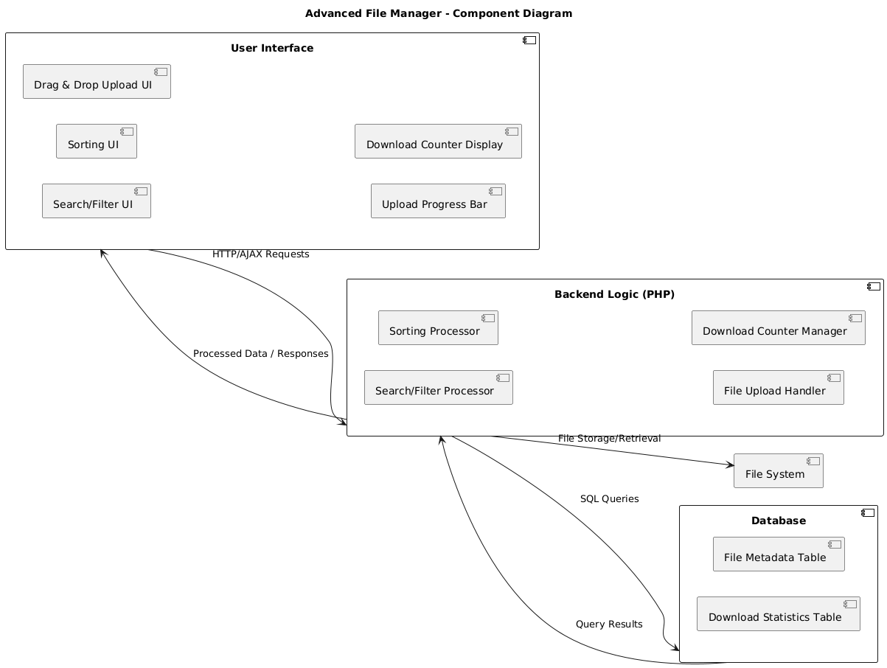
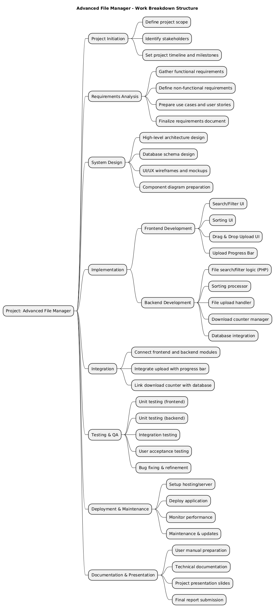

# summer25_CSE412S02_Lab2

I have attached the screenshot of the project webview 

group 5

For anyone who has access to this Repository, please create your folder using this reference

[yourname_folder details_version]

shahriyar_databasecode_v1

# 📁 Advanced File Manager Features

A modern file management interface with advanced functionalities to enhance user experience and control.

---

## 🔍 Search / Filter Files
Easily find files by:
- Name
- Type
- Upload Date

Includes a responsive search bar for instant filtering.

---

## 📊 Download Counter
Track file popularity with a visible **download count** for each file.

---

## ↕️ Sort Files
Sort files dynamically by:
- Name (A–Z)
- Upload Date (Newest First)
- Size (Largest First)
- Type (e.g., PDF, Image, Video)

---

## 🖱️ Drag & Drop Upload
Upload files effortlessly:
- Drag files into the drop zone
- Automatically triggers the upload process

---

## ⏳ Upload Progress Bar
Visual feedback with a real-time **progress bar**:
- Shows percentage uploaded
- Enhances user experience during large file uploads

---

## Project Diagrams

The diagrams were created with **draw.io** (source files included).

### Component Diagram

<small>Figure 1: Component Diagram (created using draw.io)</small>

[Download Component_diagram.drawio (editable source)](./diagrams/UML_Componect_Diagram.drawio)

---

### Work Breakdown Structure (WBS)

<small>Figure 2: Work Breakdown Structure (created using draw.io)</small>

[Download WBS_diagram.drawio (editable source)](./diagrams/Work_Breakdown_Structure_diagram.drawio)

